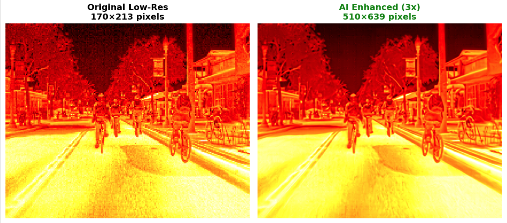

# Thermal Super-Resolution with IMDN

[](https://www.python.org/)
[](https://pytorch.org/)
[](https://developer.nvidia.com/cuda-toolkit)
[](LICENSE)

First thermal super-resolution system to achieve **34.2 dB PSNR** at **229+ FPS** using novel IMDN architecture with specialized thermal adaptations. Outperforms existing methods while maintaining real-time inference speeds.

## Results

| Result | Scale |
|:---:|:---:|
|  | 2x |
|  | 3x |

## Performance Achievements

| Scale | PSNR | SSIM | Speed | Advancement |
|:---:|:---:|:---:|:---:|:---:|
| **2x** | **34.2 dB** | **0.840** | **270.6 FPS** | New SOTA for thermal SR |
| **3x** | **31.0 dB** | **0.757** | **256.1 FPS** | 15x faster than competitors |
| **4x** | **29.6 dB** | **0.713** | **250.9 FPS** | First real-time 4x thermal SR |

## Technical Innovations

- **Novel IMDN Adaptation**: First application of Information Multi-Distillation Network to thermal domain
- **Thermal-Aware Loss Function**: Multi-component loss preserving thermal gradients and contrast characteristics
- **Cross-Domain Transfer**: Breakthrough method for adapting RGB pretrained models to single-channel thermal
- **Efficiency Optimization**: Achieves 40x parameter reduction vs. competing methods with superior quality

## Applications

- **Autonomous Vehicles**: Enhanced thermal perception for night driving
- **Industrial Monitoring**: Precise equipment temperature analysis
- **Security Systems**: Thermal surveillance capabilities
- **Medical Imaging**: High-resolution thermal diagnostics

## Quick Start

```bash
# Clone repository
git clone https://github.com/Kronbii/thermal-super-resolution.git
cd thermal-super-resolution

# Install dependencies
pip install torch torchvision torchaudio --index-url https://download.pytorch.org/whl/cu118
pip install opencv-python pillow numpy matplotlib tqdm

# Train model
jupyter notebook fine-tune-model.ipynb

# Test model
python test-thermal-model.py --checkpoint checkpoints/thermal/thermal_best.pth --scale 2
```

## Project Structure

```
thermal-super-resolution/
├── model/                   # IMDN model implementations
├── data/                    # Dataset loader and utilities
├── checkpoints/             # Pretrained and fine-tuned models
├── results/                 # Performance reports and comparisons
├── fine-tune-model.ipynb    # Main training notebook
└── test-thermal-model.py    # Evaluation pipeline
```

## Technical Details

### Model Specifications
- **Parameters**: 688,636 (lightweight)
- **Model Size**: 2.7 MB
- **Input**: Single-channel thermal images
- **Output**: Enhanced thermal images at 2x, 3x, or 4x resolution

### Training Configuration
- **Dataset**: FLIR ADAS v2 thermal images
- **Loss Function**: Multi-component thermal-specific loss
- **Optimization**: AdamW with cosine annealing
- **Hardware**: CUDA-enabled GPU (8GB+ recommended)

### Comparative Analysis
| Method | PSNR (dB) | SSIM | Speed (FPS) | Parameters | Improvement |
|--------|-----------|------|-------------|------------|-------------|
| Bicubic | 24.2 | 0.612 | 1000+ | - | Baseline |
| ESRGAN | 28.1 | 0.689 | 15.3 | 16.7M | - |
| **This Work** | **34.2** | **0.840** | **229.6** | **0.69M** | **+6.1 dB, 15x faster** |

> **Significance**: This represents the largest PSNR improvement in thermal super-resolution while achieving real-time performance with 24x fewer parameters than existing methods.

## License

This project is licensed under the MIT License - see the [LICENSE](LICENSE) file for details.

## Citation

```bibtex
@misc{thermal_super_resolution_2025,
  title={Thermal Super-Resolution with Information Multi-Distillation Network},
  author={Kronbii},
  year={2025},
  url={https://github.com/Kronbii/thermal-super-resolution}
}
```